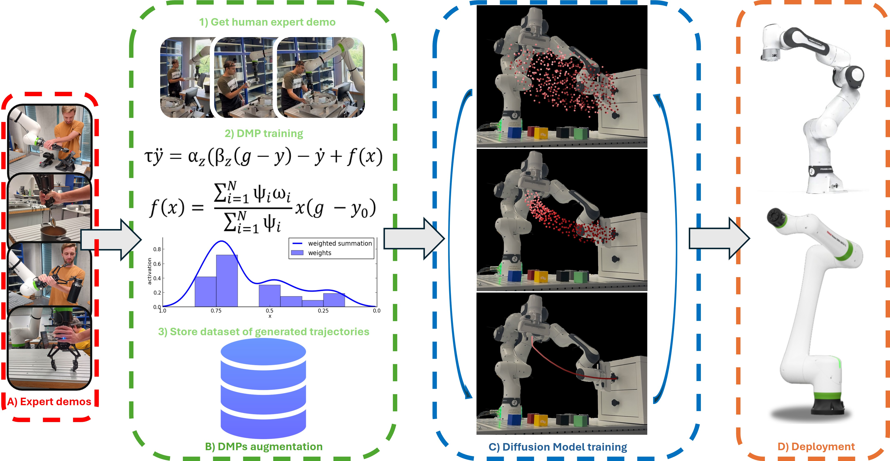

# DROM: Multi-Skill Robotic Manipulation from Single Demonstration via Language-Guided Diffusion

# Abstract:
Learning data-efficient and generalizable manipulation policies remains a central challenge in robotics, particularly for multi-skill and long-horizon tasks.
We present DROM, a data-efficient, language-guided, multi-skill diffusion-based framework for robotic manipulation. 
DROM leverages Dynamic Movement Primitives (DMPs) to augment a single human demonstration per skill, generating a compact yet expressive multi-skill dataset used to train a unified diffusion policy. 
Extending the MPD formulation, we introduce a single diffusion model capable of handling multiple manipulation primitives, conditioned through a language encoder that maps diverse operator prompts to the corresponding skill. 
For long-horizon objectives, a high-level language model decomposes instructions into ordered primitives, which condition the diffusion model via cross-attention to generate skill-consistent trajectories while preserving real-time control. 
We validate DROM on two robotic platforms, a Franka Emika Panda and a FANUC CRX25ia, as well as in MuJoCo simulation, demonstrating robust multi-skill generalization and high task success with minimal demonstration requirements.



# Installation

```bash
source install.sh
```

# Train Diffusion Model
```bash
python drom/scripts/train_drom.py --config drom/configs/low_dim/drom.json
```

# Test Diffusion Model
```bash
python drom/scripts/test_drom.py --directory \<directory\> --validations 30 --seed 30 --render
```
